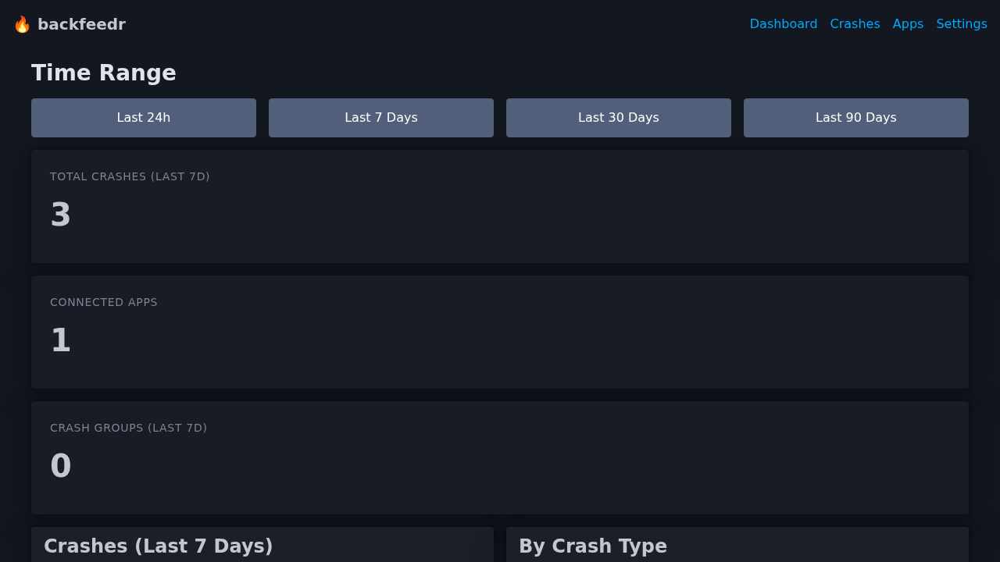
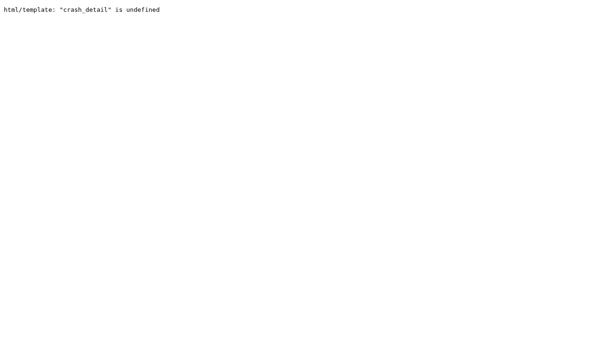

# backfeedr Documentation

> Self-hosted crash reporting & app metrics for iOS indie developers

## What You Get

After setting up backfeedr, you'll have a **complete crash reporting system** running on your own infrastructure:

### 📊 Real-Time Dashboard

Monitor your app's health with a beautiful web dashboard:


*Live dashboard showing crash statistics, trends, and recent reports*

**Features:**
- **Live Metrics** - See crash counts, active users, and trends at a glance
- **Interactive Charts** - Visualize crash patterns over time
- **Time Filtering** - Filter by last 24h, 7 days, 30 days, or 90 days
- **Device Analytics** - See which devices are most affected

### 🔍 Detailed Crash Reports

When a crash happens, you get comprehensive information:


*Full stack trace with file names, line numbers, and device context*

**Each crash report includes:**
- Complete stack trace with symbolication
- Device model and iOS version
- App version and build number
- Memory and battery status at crash time
- Locale and timezone
- Grouped by exception type for easy triage

### 📱 iOS SDK Integration

Simple Swift integration with automatic crash detection:

```swift
import BackfeedrKit

// One-time setup
Backfeedr.configure(
    endpoint: "https://crashes.yourserver.com",
    apiKey: "bf_live_your_key"
)

// That's it! Crashes are automatically reported
```

**SDK Features:**
- ✅ Automatic crash detection
- ✅ Manual error reporting
- ✅ Event tracking (sessions, custom events)
- ✅ Offline queue (crashes stored when offline)
- ✅ PII scrubbing (removes personal data)
- ✅ Lightweight (< 1MB impact)

---

## Quick Links

- [Getting Started](getting-started.md) - Installation & Setup
- [API Reference](API.md) - Complete API documentation
- [Dashboard Guide](dashboard.md) - Using the web dashboard
- [iOS SDK](ios-sdk.md) - Swift SDK documentation
- [Deployment](deployment.md) - Production deployment
- [Contributing](../CONTRIBUTING.md) - How to contribute

## Why backfeedr?

| Feature | Firebase Crashlytics | Sentry Self-Hosted | **backfeedr** |
|---------|---------------------|-------------------|---------------|
| Setup | SDK + Google account | 10+ services, complex | **1 Docker container** |
| Data Ownership | Google owns your data | You own it | **You own it** |
| Privacy | Data shared with Google | Your data stays private | **Privacy-first, no third parties** |
| Cost | Free (but you're the product) | OSS but infrastructure costs | **Forever free, open source** |
| iOS Native | Generic, not Swift-optimized | Generic | **Built for Swift developers** |
| Resource Usage | N/A (cloud) | 4GB+ RAM | **256MB RAM** |

## Quick Start

```bash
# Clone the repository
git clone https://github.com/steviee/backfeedr.git
cd backfeedr

# Start with Docker (recommended)
mkdir data
docker-compose up -d

# Or build from source
make build
./backfeedr

# Visit your dashboard
open http://localhost:8080
```

## Architecture

```
┌─────────────┐     HTTPS/JSON      ┌─────────────────┐
│   iOS App   │ ────────────────────> │  backfeedr      │
│  (Swift)    │                     │  (Go Server)    │
└─────────────┘                     │                 │
                                    │  • SQLite DB    │
┌─────────────┐     HTTP            │  • HTMX UI      │
│   Browser   │ ──────────────────> │  • REST API     │
│  (Dashboard)│                     └─────────────────┘
└─────────────┘                            │
                                           │
                                    ┌──────┴──────┐
                                    │   Your VPS   │
                                    │  (You own    │
                                    │   the data)  │
                                    └──────────────┘
```

## Project Status

⚠️ **Early Development** - APIs may change, features are incomplete. Not yet production-ready.

See our [Roadmap](../README.md#-roadmap) for planned features.

## Support

- 🐛 [Open an Issue](https://github.com/steviee/backfeedr/issues)
- 💡 [Start a Discussion](https://github.com/steviee/backfeedr/discussions)
- 📧 Contact: See repository for maintainer contact

## License

MIT © Stephan E. - See [LICENSE](../LICENSE) for details.
